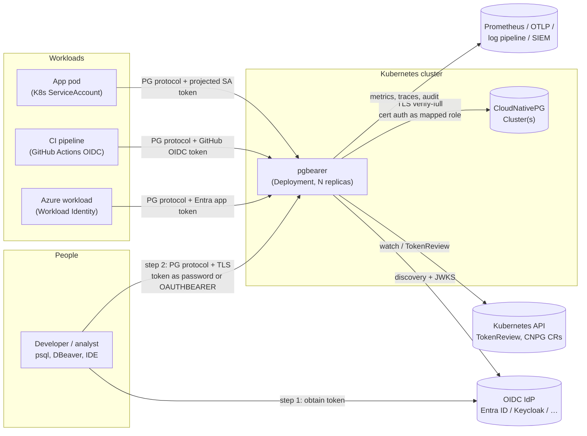
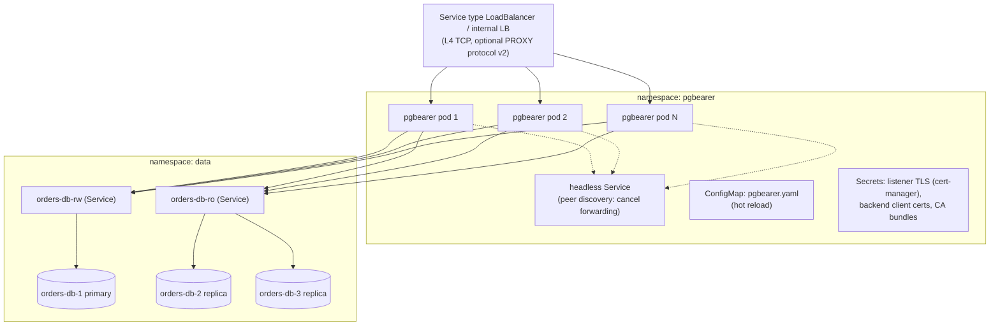
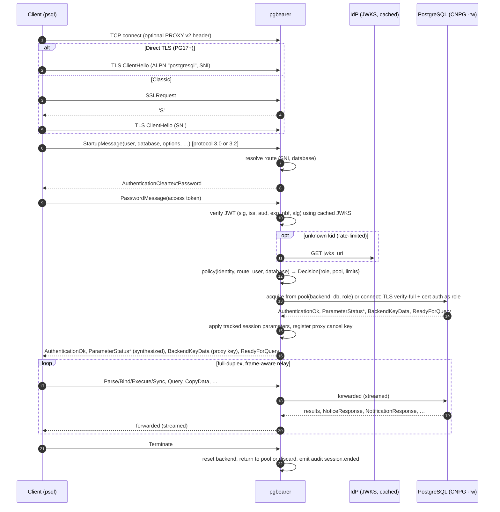
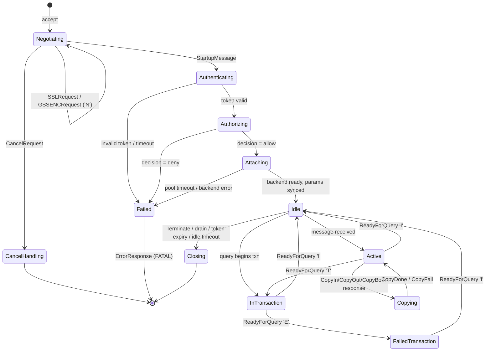

# pgbearer — Architecture

> Status: **design draft** (pre-implementation). This document describes the
> target architecture. [PLAN.md](PLAN.md) describes the order in which it is
> built. Decisions that are still open are marked **[open]**. Each one is
> settled through an ADR in `docs/adr/`.

## Contents

1. [Purpose and scope](#1-purpose-and-scope)
2. [Lessons from gprxy](#2-lessons-from-gprxy)
3. [System context](#3-system-context)
4. [Deployment view (Kubernetes)](#4-deployment-view-kubernetes)
5. [Component view (Rust workspace)](#5-component-view-rust-workspace)
6. [Connection lifecycle](#6-connection-lifecycle)
7. [Wire protocol handling](#7-wire-protocol-handling)
8. [Client authentication (OIDC)](#8-client-authentication-oidc)
9. [Authorization and identity mapping](#9-authorization-and-identity-mapping)
10. [Backend connectivity and pooling](#10-backend-connectivity-and-pooling)
11. [Query cancellation across replicas](#11-query-cancellation-across-replicas)
12. [Session lifetime and token expiry](#12-session-lifetime-and-token-expiry)
13. [Configuration model](#13-configuration-model)
14. [CloudNativePG integration](#14-cloudnativepg-integration)
15. [Microsoft Entra ID integration](#15-microsoft-entra-id-integration)
16. [Observability and audit](#16-observability-and-audit)
17. [Security architecture](#17-security-architecture)
18. [Performance design](#18-performance-design)
19. [Failure modes](#19-failure-modes)
20. [Alternatives considered](#20-alternatives-considered)

---

## 1. Purpose and scope

**pgbearer** is a PostgreSQL wire-protocol proxy that runs in Kubernetes. It
authenticates clients with **OpenID Connect / OAuth 2.0 access tokens**,
authorizes them against a central policy, and connects them to PostgreSQL as a
**least-privilege database role**. It also pools backend connections and writes
an **audit trail tied to the real identity**.

People should not need database passwords. Workloads should use their platform
identity (Kubernetes ServiceAccount, Azure Workload Identity, GitHub Actions
OIDC). All access should be granted, reviewed and revoked in the identity
provider (IdP).

### Goals

| # | Goal |
|---|------|
| G1 | Work as a drop-in endpoint for **any** PostgreSQL client (libpq/psql, pgjdbc, Npgsql, pgx, psycopg, asyncpg, node-postgres, tokio-postgres/sqlx). This includes the extended protocol, pipelining, COPY, LISTEN/NOTIFY, cancellation, and protocol 3.0 and 3.2. |
| G2 | Accept OIDC tokens from **several issuers** at once: Entra ID, Keycloak, Okta, Auth0, Dex, Google, Kubernetes ServiceAccounts and GitHub Actions. |
| G3 | Make the policy the only source of truth for *who* may connect to *which* cluster, database and role, with every decision explained in the audit log. |
| G4 | Hold **no shared superuser** and no long-lived human passwords. The backend login uses certificate authentication or per-role secrets. |
| G5 | Be **Kubernetes-native**: stateless, horizontally scalable, graceful drain, hot reload, first-class CloudNativePG support. |
| G6 | Be robust by construction: memory-safe Rust, bounded resources everywhere, fail closed, fuzzed protocol parser. |
| G7 | Add low overhead: under 100 µs p99 per round trip in session mode on the proxy's own path (see §18). |

### Non-goals (v1)

- Sharding, query rewriting or multi-backend fan-out (see PgDog/Citus).
- Acting as an identity provider or issuing tokens.
- Replacing PostgreSQL's own privilege system. pgbearer decides *which role* you
  get. PostgreSQL GRANTs and RLS decide *what that role may do*.
- GSSAPI/Kerberos for clients.

---

## 2. Lessons from gprxy

[gprxy](https://github.com/sathwick-p/gprxy) (Go) proves the concept: SSO
tokens sent as the PostgreSQL password and mapped to service accounts. A review
of its source found these structural problems, and they shape this design:

| # | gprxy behaviour | Consequence | pgbearer approach |
|---|---|---|---|
| L1 | The role-mapped service account is only used on a *temporary* authentication connection. Queries run on pooled connections that always log in with the global `GPRXY_USER`/`GPRXY_PASS`. | Role-based access control is not enforced on the data path. Every user gets the global service account's privileges. | The backend session logs in **as the role the policy chose** (§9). Pools are keyed by `(backend, database, role)`. |
| L2 | Each client login opens two backend connections (a temporary one for authentication, then a pooled one). | Double connection churn and latency, and the client sees ParameterStatus values from a different session. | One backend session per client session (session mode). Parameters are synthesized from the real backend (§7.4). |
| L3 | Lock-step relay: read one client message, forward it, then block until `ReadyForQuery`. | The extended protocol deadlocks (Parse/Bind/Execute/Sync are pipelined). COPY FROM STDIN, pipelining and async NOTIFY break. Only simple queries from psql work. | A full-duplex, frame-aware relay with a protocol state machine (§7.3). |
| L4 | The pool connection is held for the whole client session. `MaxConns=5` and `Acquire(context.Background())` has no timeout. | The 6th client hangs forever. It is not real pooling. | Bounded pools with acquire timeout, fair wait queues, SQLSTATE `53300` on exhaustion, and a transaction mode (§10). |
| L5 | Startup parameters (`application_name`, `options`, `client_encoding`, …) are not applied to the pooled connection. | Encoding and search_path mismatches and silent behaviour differences. | Tracked session parameters are applied on checkout (§10.4). |
| L6 | The backend's real PID and secret key are handed to clients. Cancel requests go to the hard-coded `DB_HOST:5432`, and the cancel registry is local to one process. | Cancellation fails behind a load balancer with more than one replica. Backend keys leak. | Proxy-generated cancel keys, peer forwarding between replicas, and protocol 3.2 long keys (§11). |
| L7 | The authentication connection to PostgreSQL is plain TCP. The pool relies on the driver default (`sslmode=prefer`, unverified). | Startup and SCRAM traffic is unencrypted inside the cluster. | `verify-full` TLS to backends by default, using the CNPG CA (§10.2). |
| L8 | Tokens are detected with an `eyJ` prefix check and silently fall back to password passthrough. Only RS256 is accepted, an `email` claim is required, and an unknown `kid` triggers a JWKS refetch with no rate limit. | Fails with Entra ID access tokens that lack `email`. The IdP can be used for amplification. Mistyped tokens are sent to PostgreSQL as passwords. | Explicit authentication methods per listener, configurable claims, an algorithm allow-list and a rate-limited JWKS cache (§8). |
| L9 | No token-expiry handling: a session lives forever after login. | Revocation in the IdP has no effect on open sessions. | A token-expiry policy with configurable grace and a maximum session lifetime (§12). |
| L10 | The cleartext password request is sent even when TLS is off. The CLI uses `InsecureSkipVerify`. | Tokens cross the network in clear text or to an unauthenticated server. | Token authentication **requires TLS**. The CLI verifies certificates (§17). |
| L11 | `wg.Add(1); go func(){ defer wg.Done(); go handle() }()` | Shutdown does not wait for connections. | Structured concurrency (`tokio` tasks plus a `TaskTracker`) and an explicit drain protocol (§4.3). |
| L12 | A failed `ROLLBACK`/`DISCARD ALL` still returns the connection to the pool. All SQL is logged at INFO. | Poisoned connections get reused. Secrets (for example `ALTER ROLE … PASSWORD`) end up in logs. | Connections that fail reset are discarded. Statement audit is opt-in and redacted (§16). |
| L13 | Configuration comes from environment variables, with `ROLE_MAPPING_X=user:password`. | Secrets sit in env vars and there is no hot reload. The setup is tied to Auth0. | A typed YAML configuration with schema, file-mounted secrets and hot reload (§13). |

---

## 3. System context



**Trust boundaries:** (a) client to pgbearer over the network, possibly from
outside the cluster; (b) pgbearer to the IdP over the internet; (c) pgbearer to
PostgreSQL inside the cluster; (d) pgbearer to the Kubernetes API.

---

## 4. Deployment view (Kubernetes)



### 4.1 Workload shape

- **Deployment** (stateless). There is no leader election. Every replica has
  its own pools.
- **Ports:** `5432` for PostgreSQL clients; `9090` for the admin HTTP server
  (`/livez`, `/readyz`, `/metrics`, admin API); `6543` for peer cancel
  forwarding, reachable only from other pgbearer pods through NetworkPolicy.
- **PodDisruptionBudget**, topology spread across zones, anti-affinity per
  node.
- **HorizontalPodAutoscaler** on CPU plus the custom metric
  `pgbearer_client_connections` (through KEDA or prometheus-adapter).
- **Security context:** non-root, read-only root filesystem, all
  capabilities dropped, `seccompProfile: RuntimeDefault`. The image is
  distroless or static.

### 4.2 Probes

| Probe | Semantics |
|---|---|
| `livez` | The runtime is responsive. The event-loop watchdog ticked within the last N seconds. |
| `readyz` | Listeners are bound, configuration is valid, and JWKS is loaded for every *required* issuer. Readiness is **not** gated on backend reachability. During a database outage, clients should get a proper PostgreSQL error (`08006`), not a refused TCP connection. |
| `startupProbe` | The same as `readyz`, with a longer budget for the first JWKS fetch. |

### 4.3 Graceful drain

Triggered by SIGTERM or the admin API:

1. `readyz` returns 503 immediately, and the endpoint is removed from the
   Service.
2. The proxy keeps accepting connections for `drain.accept_grace` (default
   5 s) to cover endpoint-propagation delay, then closes its listeners.
3. **Transaction-mode** sessions get a `FATAL 57P01 admin_shutdown` at their
   next idle boundary. Well-behaved clients and pools reconnect to another
   replica.
4. **Session-mode** sessions are allowed to finish for up to
   `drain.session_timeout`. After that they receive `57P01` at the next idle
   boundary (never in the middle of a transaction unless the hard deadline is
   reached).
5. Pools close their backend connections cleanly with `Terminate`.
6. `terminationGracePeriodSeconds` must be greater than
   `accept_grace + session_timeout + 5s`. The Helm chart computes it.

### 4.4 Exposure options

| Option | When to use it |
|---|---|
| ClusterIP only | In-cluster workloads. |
| Internal LoadBalancer (Azure/AWS/GCP internal LB) | Developers on VPN or ExpressRoute or private network. **Recommended** for human access. |
| Public LoadBalancer + IP allow-list | Only if required. Tokens are still mandatory and TLS is enforced. |
| Gateway API `TLSRoute` (passthrough) | Only with **direct TLS** clients (PostgreSQL 17+ `sslnegotiation=direct`). The ALPN `postgresql` and SNI are then visible to the gateway. |
| Gateway API `TCPRoute` | Any client. The gateway does L4 forwarding only. |

**Multi-tenant routing by SNI:** libpq has sent SNI since PostgreSQL 14
(`sslsni=1`), both after `SSLRequest` and with direct TLS. One pgbearer
deployment can front many CNPG clusters, for example
`orders.db.example.com` and `billing.db.example.com`, behind one load balancer,
using a wildcard certificate.

---

## 5. Component view (Rust workspace)

```text
pgbearer/
├── crates/
│   ├── pgbearer-wire/       # PG protocol codec: framing, message views, startup/SSL/GSS/cancel,
│   │                        # protocol 3.0/3.2 negotiation. No I/O policy. Fuzzed.
│   ├── pgbearer-tls/        # rustls server/client configs, SNI/ALPN, cert hot-reload
│   ├── pgbearer-auth/       # OIDC discovery, JWKS cache, JWT validation, claim mapping,
│   │                        # SASL OAUTHBEARER (server), TokenReview, backend auth (SCRAM/cert)
│   ├── pgbearer-policy/     # Identity model, policy rules → Decision
│   ├── pgbearer-pool/       # Endpoints, discovery (static/DNS/CNPG), pools, health, limits
│   ├── pgbearer-session/    # Client session state machine, relay, txn pooling,
│   │                        # prepared-statement tracking, cancel registry & peer forwarding
│   ├── pgbearer-audit/      # Audit event model + sinks
│   ├── pgbearer-telemetry/  # tracing, metrics registry, OTLP
│   ├── pgbearer-config/     # Typed config, JSON schema, validation, hot reload (arc-swap)
│   ├── pgbearer-k8s/        # (feature "kubernetes") CNPG watchers, Secret watchers, CRDs (later)
│   ├── pgbearer/            # bin: the proxy server (wiring, admin HTTP via axum)
│   └── pgbearerctl/         # bin: CLI — login (PKCE/device), token, connect, doctor
├── deploy/helm/pgbearer/    # Helm chart
├── deploy/examples/         # CNPG + Entra ID, CNPG + Keycloak, kind dev setup
├── docs/adr/                # Architecture Decision Records
├── fuzz/                    # cargo-fuzz targets (wire codec, SASL, JWT parsing)
└── tests/                   # integration + e2e harness (testcontainers, kind)
```

Dependency direction: `wire ← auth/session ← pool ← pgbearer`. `policy` depends
only on the identity types. No crate depends on `pgbearer-k8s` except the binary
(behind a feature flag), so the proxy also runs outside Kubernetes.

### 5.1 Key crates (initial choices, confirmed in ADRs)

| Concern | Choice | Rationale |
|---|---|---|
| Async runtime | `tokio` (multi-thread) | Ecosystem standard. `TaskTracker` and `CancellationToken` give structured shutdown. |
| Buffers | `bytes`, `tokio-util::codec` | Zero-copy framing. |
| TLS | `rustls` + `tokio-rustls`, `aws-lc-rs` provider | Memory-safe, ALPN/SNI support, FIPS-capable provider. |
| JWT/JWKS | `jsonwebtoken` behind an internal `TokenVerifier` trait | Mature; RS/PS/ES/EdDSA support. The trait allows swapping it. |
| HTTP client (JWKS, discovery) | `reqwest` (rustls, no native-tls) | Timeouts, proxy support, connection reuse. |
| Admin HTTP | `axum` | Small, tower middleware. |
| Config | `serde` + a maintained YAML implementation **[open]**, `schemars` for JSON Schema | `serde_yaml` is unmaintained. Evaluate `serde-saphyr` and `serde_norway`. |
| Hot reload | `arc-swap` | Lock-free reads of the current configuration snapshot. |
| Metrics | `prometheus-client` (OpenMetrics) | Official, typed, no global registry. |
| Tracing and logs | `tracing`, `tracing-subscriber` (JSON), `opentelemetry-otlp` | Structured logs and distributed traces. |
| Kubernetes | `kube` + `k8s-openapi` | Watchers and CRDs in Rust. |
| Secrets in memory | `secrecy`, `zeroize` | Tokens and keys never `Debug`-print and are wiped on drop. |
| SQL inspection (optional) | `pg_query` (libpg_query) behind feature `sql-inspect` | Exact PostgreSQL grammar for audit fingerprinting and statement policy. A C dependency, hence opt-in. |
| CLI | `clap`, `keyring`, `oauth2` | Token cache in the OS keychain. |

**Own wire codec instead of `pgwire`:** `pgwire` is designed to *implement* a
PostgreSQL-compatible server and decodes messages fully. A proxy needs
header-only framing with streaming of large bodies and minimal copying, in
both directions, and it needs the frontend side as well. Ideas and test
vectors come from `postgres-protocol`, PgDog and pgcat. This is ADR-002.

---

## 6. Connection lifecycle



### 6.1 Session state machine



In **transaction mode**, the backend is detached at `Idle` and re-acquired on
the next message. In **session mode** it stays attached until `Closing`.

---

## 7. Wire protocol handling

### 7.1 Framing

- Startup-phase packets have no type byte (`int32 len | int32 code | …`). The
  proxy recognises `StartupMessage` (196608 = 3.0, 196610 = 3.2),
  `SSLRequest` (80877103), `GSSENCRequest` (80877104, always answered `'N'`) and
  `CancelRequest` (80877102). A TLS record (`0x16`) is recognised as the first
  byte of **direct TLS**.
- Regular messages are `u8 type | int32 len | body`. The codec parses **only
  the 5-byte header** on the fast path. Bodies are streamed: a 500 MB
  `DataRow` or `CopyData` is never buffered whole.
- Hard limits before authentication: startup packet ≤ 10 000 bytes (the same as
  PostgreSQL), password/SASL message ≤ 16 KiB (configurable; Entra tokens with
  many groups can be large), and an authentication timeout of 10 s. After
  authentication, messages are bounded by PostgreSQL's own limits and streamed.

### 7.2 Protocol versions

- Supports **3.0** and **3.2** (PostgreSQL 18). With 3.2 the cancel secret is
  variable length (4–256 bytes), and the proxy issues 32-byte secrets.
- An unknown minor version (3.3 and later) or `_pq_.*` options are answered
  with `NegotiateProtocolVersion`, listing the highest supported minor version
  and the unrecognised options, as the protocol specifies.
- The backend protocol version is negotiated independently of the client's.
  Message formats that differ (BackendKeyData, CancelRequest) are translated at
  the proxy.

### 7.3 Relay

The relay is **full-duplex**: one task per client connection runs a
`select!` over client-readable, backend-readable, control channel (drain,
cancel, token expiry) and timers. It tracks only what it needs:

| Tracked | Why |
|---|---|
| `ReadyForQuery` status (`I`/`T`/`E`) | Transaction boundaries for transaction pooling, safe points for drain and expiry. |
| Pending `Sync` count and pipeline depth | Release the backend only when the pipeline is fully drained. |
| COPY sub-protocol state | Never detach or interrupt mid-COPY. |
| `ErrorResponse` with severity FATAL/PANIC | Discard the backend connection. |
| `ParameterStatus` | Keep the client-visible parameter set accurate. |
| `Terminate` (client) | Intercepted. It is not forwarded to a pooled backend. |
| `Parse`/`Close` of named statements (transaction mode only) | Prepared-statement virtualisation (§10.5). |

Asynchronous backend messages (`NoticeResponse`, `NotificationResponse`,
`ParameterStatus`) are forwarded whenever they arrive, also while idle in
session mode.

### 7.4 Startup parameter synthesis

The client must see the **real** `server_version`, `server_encoding`,
`integer_datetimes` and so on, from the backend it is actually talking to.
The proxy sends `ParameterStatus` from the attached backend after applying
the client's tracked parameters (`client_encoding`, `DateStyle`, `TimeZone`,
`IntervalStyle`, `application_name`, `extra_float_digits`, `search_path`,
`standard_conforming_strings`, plus `-c` entries in `options`).
`options` entries that would bypass policy are rejected with `28000`. These
are `role`, `session_authorization`, and any `pgbearer.*` GUC.

---

## 8. Client authentication (OIDC)

### 8.1 Client-facing methods

| Method | Client support | Notes |
|---|---|---|
| **Token as password** (`AuthenticationCleartextPassword`) | Every PostgreSQL client and driver. | **Requires TLS**: the listener refuses cleartext auth on a non-TLS connection unless `insecure_dev_mode` is set. The same UX as Azure Database for PostgreSQL with Entra ID. |
| **SASL `OAUTHBEARER`** (RFC 7628) | libpq/psql ≥ 18 built with OAuth support (`oauth_issuer`, `oauth_client_id`); built-in Device Authorization flow (RFC 8628), not on Windows. | No helper tool needed: psql runs the device flow itself. The proxy answers the discovery exchange with the issuer's `/.well-known/openid-configuration` URL and the required scope. |
| mTLS client certificate **[later]** | All clients. | For workloads with SPIFFE/cert-manager identities. |

**Selecting the method.** libpq picks `OAUTHBEARER` whenever the server offers
it, and clients without OAuth support fail. So the method cannot be negotiated
in-band. It is chosen **per listener or route**, for example a dedicated port
or an SNI hostname like `oauth.orders.db.example.com`. The default is token as
password.

### 8.2 Validation pipeline

```text
raw token ─► size check ─► JWT? ──no──► introspection (RFC 7662) [later] / reject
                              │yes
                              ▼
             header: alg ∈ allow-list (RS256, PS256, ES256, EdDSA; never none/HS*), kid present
                              ▼
             issuer selection: unverified `iss` → configured IdP (exact match, no prefix tricks)
                              ▼
             JWKS lookup (cache) → signature verify
                              ▼
             claims: iss == configured; aud ∈ audiences; exp/nbf/iat with leeway (default 60 s);
                     optional: typ == "at+jwt" (RFC 9068 IdPs; Entra uses "JWT"),
                     azp/appid allow-list, tid allow-list,
                     required scopes (scp) or app roles (roles)
                              ▼
             Identity { issuer, subject, username, tenant, groups, roles, scopes, client_id,
                        kind: Human|Workload, expires_at, token_id }
```

- **The issuer is selected from configuration, never discovered from the
  token.** An unknown `iss` is rejected before any network call.
- Validation errors produce a generic client message (`28P01`, "token
  validation failed"). The precise reason goes only to the audit log and
  metrics.

### 8.3 JWKS cache

- Per-issuer discovery (`/.well-known/openid-configuration`) and JWKS fetch at
  startup. Readiness waits for required issuers.
- Background refresh at `max(Cache-Control max-age, min_refresh)`, capped at
  `max_age` (default 1 h).
- **Unknown `kid`:** a single-flight refresh with a minimum interval (default
  30 s) per issuer, so an attacker cannot turn pgbearer into a JWKS-fetch
  amplifier.
- **Stale-while-error:** if refresh fails, keep the last good key set for up to
  `max_stale` (default 24 h), raise an alert metric, and never drop to an empty
  set.
- Keys are accepted when `use` is absent or `sig`, and `alg`, if present, must
  match the header.

### 8.4 Issuer types

| Type | Validation | Typical subject |
|---|---|---|
| `oidc` (generic) | Discovery + JWKS | `sub`, or a configured claim. |
| `entra` | `oidc` plus Entra defaults: subject `oid`, `tid` allow-list, v2 issuer format, `scp`/`roles`, `idtyp`, groups-overage detection | `oid` (immutable object ID). |
| `kubernetes` | JWKS from the cluster issuer, **or** the `TokenReview` API (authoritative; rejects tokens of deleted pods) | `system:serviceaccount:<ns>:<name>` |
| `github-actions` | `oidc` preset for `https://token.actions.githubusercontent.com` | `repo:<org>/<repo>:environment:<env>` |

### 8.5 Groups and roles

- Prefer **app roles** (`roles` claim) over groups for authorization. They are
  scoped to the application, have no overage problem, and work for both users
  and service principals.
- **Groups overage (Entra ID):** with more than 200 groups, a JWT carries no
  `groups` claim, only `_claim_names`/`_claim_sources` (or `hasgroups`).
  pgbearer detects this. The default is to **fail closed** for group-based
  rules, with a clear audit reason. An optional resolver can query Microsoft
  Graph `transitiveMemberOf` with pgbearer's own workload identity and a cache
  (PLAN Phase 7). The recommended fix is to emit only "groups assigned to the
  application".

---

## 9. Authorization and identity mapping

### 9.1 Policy model

A policy is a list of **grants**. Each grant has a `when` (a predicate over
the identity and the connection) and a `grant` (what may be accessed). The
rules are:

- **Default deny.** No matching grant means the connection is refused
  (`28000`).
- **Explicit `deny` rules win** over grants. Examples: block a tenant, block
  a compromised subject, block a time window.
- Matching grants are **unioned** to compute the identity's entitlements:
  a set of `(backend, database, pg_role)` plus limits.
- The **requested startup `user`** selects a role among the entitlements:
  - `user` equal to an entitled `pg_role` → that role.
  - `user` equal to the identity's username (for example the UPN) or `*` → the
    grant's `default_pg_role`.
  - Anything else → deny. (`user_semantics: role | identity | auto`, default
    `auto`.)
- Each decision records the matched grant names, and they are written to the
  audit event.

```yaml
policies:
  - name: orders-analysts
    when:
      issuer: entra
      roles_any: ["Orders.Analyst"]        # Entra app role
    grant:
      backend: orders
      databases: ["orders"]
      pg_roles: ["orders_readonly"]
      default_pg_role: orders_readonly
      max_connections_per_identity: 5

  - name: orders-api
    when:
      issuer: k8s
      subject: "system:serviceaccount:orders:orders-api"
    grant:
      backend: orders
      databases: ["orders"]
      pg_roles: ["orders_app"]
      pool_mode: transaction

  - name: orders-migrations
    when:
      issuer: github
      subject: "repo:acme/orders:environment:production"
    grant:
      backend: orders
      databases: ["orders"]
      pg_roles: ["orders_owner"]
      session_max_lifetime: 30m

deny:
  - name: no-guests
    when:
      issuer: entra
      claim: { name: "acct", equals: 1 }    # Entra guest accounts (optional claim "acct")
```

The rule language is deliberately small and declarative in v1. Expression
support (CEL) and external engines (OPA/Cedar) are post-1.0 options (PLAN
Phase 7) behind the same `PolicyEngine` trait.

### 9.2 Backend identity strategies

pgbearer must log in to PostgreSQL **as the chosen role**, so that PostgreSQL's
privilege system, RLS, `current_user` and pgaudit all see the effective role.
There are three ways to authenticate that login:

| Strategy | How | Pros | Cons |
|---|---|---|---|
| **A. Certificate + `pg_ident` (recommended)** | pgbearer holds **one** client certificate (CN=`pgbearer`) from the cluster's client CA. In `pg_ident.conf`, `pgbearer pgbearer +pgbearer_login` lets that certificate log in as any **member of `pgbearer_login`** (`+role` syntax, PostgreSQL 16+). | No passwords anywhere. One secret to rotate (automatic with CNPG or cert-manager). The set of reachable roles is controlled *in the database* through `GRANT pgbearer_login TO …`. | Needs PostgreSQL 16+ for `+role` (on 14–15, list roles explicitly). The certificate must be distributed to the pgbearer namespace. |
| **B. Per-role client certificates** | A CNPG 1.30+ `DatabaseRole` with `clientCertificate: {}` issues `<role>-client-cert` Secrets, and pgbearer mounts one per role. | Native CNPG with automatic renewal. No `pg_ident` map needed. | One secret per role. |
| **C. Per-role passwords** | SCRAM-SHA-256 with passwords from Secrets (CNPG `passwordSecret`). | Works with any PostgreSQL (including managed services outside Kubernetes). | Passwords to rotate. The proxy holds many credentials. |

**Why not one "authenticator" login plus `SET ROLE`** (the PostgREST pattern)?
A client can run `RESET ROLE` or `SET ROLE other` (or the
`set_config('role', …)` equivalent) and move to any role the authenticator is
a member of. That is privilege escalation unless every statement is parsed and
filtered, and parsing PL/pgSQL, `DO` blocks and functions is not something
security should depend on. With strategy A, a `SET ROLE` can only reach roles
the *mapped* role itself is a member of, which is ordinary PostgreSQL
semantics under the DBA's control.

**Role design guidance** (shipped as docs and examples):

```sql
CREATE ROLE pgbearer_login NOLOGIN;                        -- gate for strategy A (no privileges)
CREATE ROLE orders_readonly LOGIN IN ROLE pgbearer_login;  -- reachable through pgbearer
GRANT pg_read_all_data TO orders_readonly;                 -- or fine-grained grants
-- Membership is transitive: never GRANT a pgbearer-reachable role TO a privileged role,
-- and never make superuser / CREATEROLE / REPLICATION / BYPASSRLS roles members of pgbearer_login.
```

**Role safety check:** when a pool for a role is first created, pgbearer
reads `pg_roles` for that role. It refuses to use roles with `rolsuper`,
`rolcreaterole`, `rolreplication` or `rolbypassrls` unless the grant sets
`allow_privileged_role: true` (meant for break-glass grants). It logs the
role's effective memberships. `pgbearerctl doctor` runs the same check
offline against every role reachable through `pgbearer_login`.

### 9.3 Identity propagation (audit, not authorization)

On every checkout pgbearer sets session-level GUCs, `pgbearer.sub`,
`pgbearer.username` and `pgbearer.session_id`. It can also append the identity
to `application_name` (opt-in, because some apps read it). These values make
PostgreSQL logs and `pg_stat_activity` correlatable with pgbearer's audit log.

> ⚠️ A client can overwrite these GUCs within its own session. They are
> **audit hints, not a security boundary**. Do not base RLS policies on them.
> When per-person RLS is needed, use **personal roles** (PLAN Phase 7: JIT
> provisioning of one PostgreSQL role per identity), so that `current_user`
> itself is the identity.

---

## 10. Backend connectivity and pooling

### 10.1 Backends and discovery

| Kind | Resolution |
|---|---|
| `static` | `host:port` list. DNS is re-resolved on connect (TTL-respecting). |
| `cnpg` | `Cluster` name + namespace + service (`rw`/`ro`/`r`) → `<cluster>-<svc>.<ns>.svc:5432`. The `Cluster` CR is also **watched** for `status.currentPrimary`, `targetPrimary` and phase (§10.6). |

### 10.2 TLS to the backend

The default is `verify-full`. For CNPG the CA comes from the `<cluster>-ca`
Secret (`ca.crt`), and the server name is the Service DNS name, which CNPG
puts in the server certificate. SCRAM channel binding
(`SCRAM-SHA-256-PLUS`, `tls-server-end-point`) is used when strategy C is
used over TLS.

### 10.3 Pools

- **Pool key:** `(backend, database, pg_role)`. Startup parameters are *not*
  part of the key. They are applied on checkout (§10.4), which keeps pool
  count and fragmentation low.
- **Limits:** `max_connections` per pool, `max_backend_connections` per backend
  (all pools to one cluster), `max_connections_per_identity`, and a global
  `max_client_connections`.
- **Acquire:** a FIFO wait queue with `acquire_timeout` (default 5 s). On
  timeout the client gets `53300 too_many_connections` with a hint.
- **Health:** test-on-borrow only when the connection has been idle longer than
  `health_check_idle` (cheap empty `Query` round trip).
  `max_lifetime` has ±10 % jitter so connections are not all recycled at
  once, plus `idle_timeout`.
- **Reset on release (session mode):** `DISCARD ALL` (configurable
  `reset_query`), sent only when the connection is idle, outside a transaction
  and outside COPY. A failed reset, or any FATAL seen on the connection,
  **discards** it.
- **Budgeting:** every replica has its own pools, so the total backend
  connections are at most `replicas × max_backend_connections`. The Helm chart
  checks this against `max_connections` from the CNPG `Cluster` for the
  configured HPA maximum. A replica-count-aware shared budget is a later item.

### 10.4 Session parameters

Each pooled connection records its current tracked parameters. On checkout,
pgbearer compares them with the client's desired set and sends one `SET …;`
batch for the differences before forwarding client traffic. `ParameterStatus`
replies keep the record accurate. This is the same approach as PgBouncer's
`track_extra_parameters`, but applied to every tracked parameter.

### 10.5 Pooling modes

| Mode | Semantics | Default for |
|---|---|---|
| `session` | One backend connection is bound for the client's lifetime. Fully compatible: LISTEN/NOTIFY, session GUCs, temporary tables, advisory locks, SQL `PREPARE`, `WITH HOLD` cursors. | Humans and tools. **Global default.** |
| `transaction` | The backend is bound from the first message after idle until `ReadyForQuery 'I'` with no pending Sync or COPY. | High-concurrency apps (opt-in per grant). |

Transaction mode includes **protocol-level prepared-statement
virtualisation**. Named `Parse` messages are renamed to content-addressed
names (`__pgb_<hash>`). pgbearer tracks which backend connection has which
statement prepared, and injects `Parse` before `Bind` on connections that do
not have it yet. `Close` is handled locally, and an LRU per connection is
bounded by `max_prepared_statements`. This is the approach of PgBouncer 1.21+
and PgDog. Session-state statements in transaction mode (`SET` without
`LOCAL`, `LISTEN`, SQL `PREPARE`, advisory locks, temporary tables) are handled
according to `transaction_mode.session_state: warn | pin | error`. `pin` keeps
the backend bound for the rest of the session. Detecting these statements
needs the `sql-inspect` feature; without it, pgbearer only documents the
limitation, as PgBouncer does.

### 10.6 CloudNativePG failover and switchover

pgbearer watches the `Cluster` CR. When `currentPrimary` changes:

1. Mark `rw` pools for that cluster as **stale**: no new checkouts from them,
   and idle connections are closed immediately.
2. Close in-use connections at the next idle boundary. The client gets `57P01`
   (transaction mode) or keeps its session until the backend fails (session
   mode). In practice CNPG terminates sessions on the old primary during
   switchover, and the client then gets a clean `57P01`/`08006` instead of a
   hung socket.
3. New connections go to the `-rw` Service, which CNPG has already moved to
   the new primary.

The CR watch lets pgbearer react before TCP timeouts would. It is
optimisation only. Without Kubernetes API access, connection errors trigger the
same pool invalidation.

---

## 11. Query cancellation across replicas

PostgreSQL sends a `CancelRequest` on a **new** TCP connection, which the load
balancer may route to a **different** pgbearer replica.

- pgbearer **never exposes backend keys**. Each client session gets a
  proxy-generated key: `pid` (32 bit) = `replica_tag (12 bit) | session_seq
  (20 bit)`, and `secret` = CSPRNG bytes (4 bytes with protocol 3.0, 32 bytes
  with 3.2). The `replica_tag` is a hash of the pod name, so every replica can
  compute its peers' tags from the endpoints it discovers.
- The receiving replica looks up the key locally. If it is not found and the
  `replica_tag` belongs to a peer, it forwards the raw cancel packet to that
  peer's **peer port** (`6543`). If the tag is unknown or shared by more than
  one peer (a hash collision), it broadcasts to all peers, which are
  discovered through the headless Service. Peer-received cancels are never
  forwarded again.
- The owning replica maps the key to the **currently attached** backend
  connection and sends the real backend cancel. In transaction mode, if no
  backend is attached, the cancel is dropped (there is nothing to cancel). A
  per-session "cancel in flight" flag delays backend release until the
  backend cancel has been delivered, capped at `cancel_release_delay`
  (default 200 ms). A cancel that is still in flight therefore cannot hit the
  next borrower of that connection.
- Cancel requests are rate-limited per source IP and counted in metrics.
  Unknown keys are dropped silently, as PostgreSQL does.

This is comparable to PgBouncer's peering (1.19+), but it needs no static peer
list.

---

## 12. Session lifetime and token expiry

Access tokens typically live 60–90 minutes, while PostgreSQL sessions can last
much longer. Policy, configurable per grant:

| Setting | Default | Behaviour |
|---|---|---|
| `on_token_expiry` | `terminate_when_idle` | After `exp + grace`, the session is closed at the next idle boundary with `FATAL 28000` ("credentials expired; reconnect with a fresh token"). Alternatives: `terminate` (immediately, even mid-transaction) and `ignore` (rely on `max_lifetime`). |
| `token_expiry_grace` | `5m` | Covers clock skew and lets running work finish. |
| `max_lifetime` | `12h` | Hard cap regardless of token. |
| `idle_timeout` | `1h` | Client idle (no transaction open). |
| `idle_in_transaction_timeout` | `10m` | Protects pools from forgotten open transactions. |

PostgreSQL has no in-band re-authentication, so a client cannot refresh the
token on an open session. Pools in applications (HikariCP, pgx pool, and
others) handle reconnects transparently, and `pgbearerctl` refreshes tokens
before connecting.

---

## 13. Configuration model

- A **single YAML file** (`pgbearer.yaml`), versioned (`apiVersion:
  pgbearer/v1alpha1`), with a published **JSON Schema** for editor
  validation. Unknown fields are an error.
- **Secrets are referenced as files** (`*_file`), mounted from Kubernetes
  Secrets. Environment variables are only for overrides
  (`PGBEARER_LOG_LEVEL`, …).
- **Hot reload:** a file watcher, plus SIGHUP, plus `POST /admin/reload`. The new
  configuration is fully parsed and validated, and the JWKS of new issuers is
  pre-fetched, *before* an atomic swap (`arc-swap`). Existing sessions keep
  their decision. New sessions use the new snapshot. An invalid configuration
  is rejected, the old one stays active, and the
  `pgbearer_config_reload_errors_total` metric is incremented.
- TLS certificates (listener and backend client certificates) are reloaded on
  file change, which handles cert-manager and CNPG rotation without a restart.

```yaml
apiVersion: pgbearer/v1alpha1
kind: ProxyConfig

listeners:
  - name: postgres
    address: "0.0.0.0:5432"
    tls:
      cert_file: /etc/pgbearer/tls/tls.crt
      key_file: /etc/pgbearer/tls/tls.key
      min_version: "1.2"
      direct_tls: true                 # PG17+ sslnegotiation=direct (ALPN "postgresql")
    proxy_protocol: optional           # off | optional | required
    client_auth: token_password        # token_password | oauthbearer

identity_providers:
  - name: entra
    type: entra
    issuer: "https://login.microsoftonline.com/<tenant-id>/v2.0"
    audiences: ["<pgbearer-api-client-id>"]     # Entra v2 tokens: aud = API client ID
    tenants: ["<tenant-id>"]
    required_scopes: ["Database.Connect"]       # delegated (user) tokens
    oauthbearer:                                # used only by oauthbearer listeners
      scope: "api://pgbearer/Database.Connect"
  - name: k8s
    type: kubernetes
    validation: token_review                    # or: jwks
    audiences: ["pgbearer"]
  - name: github
    type: github-actions
    audiences: ["pgbearer"]

backends:
  - name: orders
    cnpg: { cluster: orders-db, namespace: data, service: rw }
    tls:
      mode: verify-full
      ca_file: /etc/pgbearer/backends/orders/ca.crt
    login:
      method: cert                              # cert | password
      cert_file: /etc/pgbearer/backends/orders/client/tls.crt
      key_file: /etc/pgbearer/backends/orders/client/tls.key
    pool:
      max_backend_connections: 80
      max_connections: 20
      acquire_timeout: 5s
      idle_timeout: 10m
      max_lifetime: 1h

routes:
  - match: { sni: "orders.db.example.com" }
    backend: orders
  - match: { database: "orders" }               # fallback when no SNI
    backend: orders

policies: [...]                                  # see §9.1

session:
  on_token_expiry: terminate_when_idle
  token_expiry_grace: 5m
  max_lifetime: 12h

audit:
  sinks: [stdout]                                # stdout | otlp
  statements: none                               # none | fingerprint | full
```

---

## 14. CloudNativePG integration

### 14.1 What pgbearer needs from a CNPG cluster

```yaml
apiVersion: postgresql.cnpg.io/v1
kind: Cluster
metadata:
  name: orders-db
  namespace: data
spec:
  instances: 3
  imageName: ghcr.io/cloudnative-pg/postgresql:18
  # Optional (CNPG 1.29+): restrict cert logins to pgbearer pods when they run in this namespace
  # podSelectorRefs:
  #   - name: pgbearer
  #     selector: { matchLabels: { app.kubernetes.io/name: pgbearer } }
  postgresql:
    pg_ident:
      - "pgbearer pgbearer +pgbearer_login"
    pg_hba:
      # Must come before any broader rule for these users (first match wins).
      - "hostssl all +pgbearer_login all cert map=pgbearer"
---
apiVersion: postgresql.cnpg.io/v1
kind: DatabaseRole                      # CNPG 1.30+
metadata:
  name: orders-readonly
  namespace: data
spec:
  cluster: { name: orders-db }
  name: orders_readonly
  login: true
  inRoles: [pgbearer_login, pg_read_all_data]   # pgbearer_login: another DatabaseRole with login: false
```

### 14.2 Getting the pgbearer client certificate

| Option | Description |
|---|---|
| **cert-manager** (recommended) | CNPG in "user-provided client CA" mode with a cert-manager `Issuer` backed by that CA. A `Certificate` with `commonName: pgbearer` is issued **directly into the pgbearer namespace**. Rotation is handled by cert-manager, and pgbearer hot-reloads. |
| CNPG `DatabaseRole` with `clientCertificate` (1.30+) | Create a `DatabaseRole` named `pgbearer` (LOGIN, no privileges) with `clientCertificate: {}`. The Secret `pgbearer-client-cert` is created in the *cluster's* namespace. Either run pgbearer in that namespace, or replicate the Secret (External Secrets, Reflector) into the pgbearer namespace. |
| `kubectl cnpg certificate` | Manual or one-off. Not recommended for production rotation. |

The `pgbearer-k8s` watcher can also read the `<cluster>-ca` and client
certificate Secrets directly through the API (RBAC-scoped) instead of volume
mounts. This option is evaluated in Phase 4 **[open]**.

### 14.3 Relationship to the CNPG `Pooler` (PgBouncer)

pgbearer connects **directly to `<cluster>-rw` / `-ro`** and does its own pooling.
Placing it in front of a CNPG `Pooler` is possible but not recommended:
PgBouncer would need to authenticate as every mapped role, which defeats
strategy A. Applications with static credentials can keep using the CNPG
Pooler alongside pgbearer.

### 14.4 PostgreSQL 18 native OAuth

PostgreSQL 18 can validate OAuth tokens itself through a server-side
**validator module** (`oauth_validator_libraries`, `pg_hba` method `oauth`).
pgbearer complements that rather than competing with it:

- pgbearer works with **PostgreSQL 14–18** and with every driver. Native OAuth
  requires libpq 18 clients, and today most non-libpq drivers do not support
  it.
- pgbearer centralises policy, audit and pooling across **many clusters** and
  needs no validator module in the database image.
- pgbearer **speaks OAUTHBEARER to clients** (§8.1). A PostgreSQL 18 user gets
  the native psql device-flow UX either way.

---

## 15. Microsoft Entra ID integration

### 15.1 App registrations

1. **`pgbearer` (resource API):**
   - *Expose an API*: App ID URI `api://pgbearer`, delegated scope
     `Database.Connect`.
   - *App roles* (for example `Orders.Reader`, `Orders.Owner`) with *allowed
     member types: Users/Groups + Applications*. Use them in policies
     (`roles_any`).
   - Manifest: **`api.requestedAccessTokenVersion: 2`**
     (`accessTokenAcceptedVersion` in the legacy manifest). Otherwise the
     tokens are v1 (`iss = https://sts.windows.net/<tid>/`), which does not
     match the v2 discovery document.
   - If your tenant's app management policy requires it, use
     `api://<client-id>` instead of `api://pgbearer` throughout.
   - Enterprise application: *Assignment required = Yes*, so only assigned
     users and groups can obtain tokens at all.
   - Optional groups claim: "Groups assigned to the application" (avoids
     overage).
2. **`pgbearer-cli` (public client):** "Allow public client flows" (device
   code), redirect URI `http://localhost` (PKCE loopback), and API permission
   `api://pgbearer/Database.Connect` with admin consent.
3. **Azure CLI convenience:** pre-authorize the Azure CLI client application
   on the `pgbearer` API. Users can then get a token without any pgbearer tooling:

   ```bash
   export PGPASSWORD=$(az account get-access-token \
       --scope api://pgbearer/Database.Connect --query accessToken -o tsv)
   psql "host=orders.db.example.com dbname=orders user=orders_readonly sslmode=verify-full"
   ```

4. **psql 18 native (OAUTHBEARER listener):**

   ```bash
   psql "host=oauth.orders.db.example.com dbname=orders user=orders_readonly \
         oauth_issuer=https://login.microsoftonline.com/<tenant-id>/v2.0 \
         oauth_client_id=<pgbearer-cli-client-id>"
   # → "Visit https://microsoft.com/devicelogin and enter the code: XXXX-XXXX"
   ```

### 15.2 Claims used

| Claim | Use |
|---|---|
| `iss`, `aud`, `exp`, `nbf`, `iat` | Standard validation. With v2 tokens, `aud` is the **API's client ID** (GUID). |
| `tid` | Tenant allow-list (mandatory for `type: entra`). |
| `oid` | **Subject**: immutable object ID, used for audit and per-identity limits. |
| `preferred_username` / `upn` | Display and audit only. **Never** for authorization (mutable). |
| `scp` | Delegated scopes (user tokens), for example `Database.Connect`. |
| `roles` | App roles (users and applications), the preferred authorization input. |
| `groups`, `_claim_names`, `hasgroups` | Group IDs and overage detection (§8.5). |
| `azp` / `appid`, `idtyp` | Client allow-list. `idtyp=app` distinguishes workload tokens. |
| `acct` (optional claim, must be enabled) | `1` = guest account, which can be used in deny rules. |

### 15.3 Workloads on AKS

Pods with **Azure Workload Identity** use the client-credentials flow for
`api://pgbearer/.default`. The token carries app `roles` assigned to the managed
identity or service principal. For workloads inside the same Kubernetes cluster,
the **`kubernetes` issuer type is simpler**: a projected ServiceAccount token
with `audience: pgbearer` needs no Entra configuration.

---

## 16. Observability and audit

### 16.1 Metrics (Prometheus / OpenMetrics, `:9090/metrics`)

No per-user labels, to keep cardinality bounded. Per-identity data belongs in
the audit log.

| Metric | Labels |
|---|---|
| `pgbearer_client_connections` (gauge) | `listener`, `state` |
| `pgbearer_auth_attempts_total` | `issuer`, `result`, `reason` |
| `pgbearer_auth_duration_seconds` (histogram) | `issuer` |
| `pgbearer_policy_decisions_total` | `result`, `grant` |
| `pgbearer_pool_connections` (gauge) | `backend`, `database`, `role`, `state` |
| `pgbearer_pool_acquire_duration_seconds` (histogram) | `backend` |
| `pgbearer_pool_acquire_timeouts_total` | `backend` |
| `pgbearer_backend_connect_errors_total` | `backend`, `reason` |
| `pgbearer_transactions_total`, `pgbearer_transaction_duration_seconds` | `backend`, `mode` |
| `pgbearer_bytes_total` | `direction` |
| `pgbearer_cancel_requests_total` | `result` (`local`, `forwarded`, `unknown`) |
| `pgbearer_jwks_refresh_total`, `pgbearer_jwks_age_seconds` | `issuer`, `result` |
| `pgbearer_tls_cert_expiry_timestamp_seconds` | `cert` |
| `pgbearer_config_reload_total`, `pgbearer_config_reload_errors_total` | — |
| `pgbearer_sessions_terminated_total` | `reason` (`token_expired`, `drain`, `idle`, `lifetime`) |

The Helm chart ships a `ServiceMonitor`, a `PrometheusRule` (alerts: JWKS stale,
certificate expiring, pool saturation, authentication-failure spike), and a
Grafana dashboard.

### 16.2 Logs and traces

- Structured JSON logs (`tracing`) to stdout. Tokens, passwords and keys are
  wrapped in `Secret<T>` and cannot be logged by construction.
- OTLP traces cover the startup (auth → policy → acquire) and, if enabled,
  sampled transactions. W3C trace context can be passed in through
  `application_name` or a startup option **[open]**.

### 16.3 Audit events

A separate stream (`log.type = "audit"`) with a stable schema (versioned and
documented):

| Event | Key fields |
|---|---|
| `connection.authenticated` | `session_id`, `issuer`, `subject`, `username`, `tenant`, `client_id`, `client_ip` (PROXY-protocol aware), `tls` (version, SNI), `listener`, `auth_method` |
| `connection.denied` | Same fields plus `stage` (`token`/`policy`/`limit`), `reason` (precise, internal) |
| `session.attached` | `session_id`, `backend`, `database`, `pg_role`, `matched_grants`, `pool_mode`, `backend_pid` |
| `session.ended` | `session_id`, `duration`, `bytes_in/out`, `transactions`, `end_reason` |
| `statement` (opt-in) | `session_id`, `fingerprint` (`pg_query`) or redacted text, `duration`, `rows`, `sqlstate` |
| `cancel` | `session_id`, `result` |

`backend_pid` and the GUC `pgbearer.session_id` join the audit trail to
PostgreSQL logs and pgaudit output.

---

## 17. Security architecture

### 17.1 Threats and mitigations (summary; full STRIDE model in `docs/threat-model.md`)

| Threat | Mitigation |
|---|---|
| Token theft in transit | TLS mandatory for token authentication; TLS 1.2+ (1.3 preferred); HSTS-like refusal of cleartext. |
| Token replay against another service | Strict `aud`; a `typ=at+jwt` check where the IdP issues RFC 9068 tokens; `azp`/`appid` allow-list; short token lifetimes in the IdP. |
| Forged tokens or algorithm confusion | Algorithm allow-list, no `none`/HS*, the configured issuer decides the JWKS (never the `jku`/`x5u` headers). |
| Escalation through `SET ROLE` | Log in as the mapped role (§9.2); policy GUCs and `role` blocked in startup `options`. |
| Lateral movement via the backend credential | Strategy A is limited to `pgbearer_login` members, and superusers are excluded. pg_hba restricts the certificate login to proxy pod IPs (CNPG `podSelectorRefs`) and NetworkPolicy. |
| Pre-authentication DoS (slowloris, huge packets) | Pre-auth size and time limits, `max_pending_auth` connections, per-IP connection and authentication-failure rate limits. |
| IdP amplification via random `kid` | Single-flight, rate-limited JWKS refresh (§8.3). |
| Cancel abuse | Proxy-issued keys with 32-byte secrets on 3.2; rate limiting; never a backend key. |
| Secrets in logs or memory dumps | `secrecy`/`zeroize`; statement audit opt-in with redaction; core dumps disabled in the image. |
| Supply chain | `cargo-deny` (licences, advisories, sources), `cargo-audit`, pinned toolchain, reproducible builds, SBOM (CycloneDX), cosign keyless signatures, SLSA provenance. |
| Memory-safety bugs | `#![forbid(unsafe_code)]` in the project's own crates; fuzzing of codec, SASL and JWT parsing (cargo-fuzz in CI, OSS-Fuzz later). |

### 17.2 Hardening defaults

- `client_auth: token_password` refuses non-TLS connections.
- Default deny in policy. An empty policy means no access.
- Admin API on a separate port, protected by OIDC itself (an admin app role)
  or bound to localhost; never exposed by the default Service.
- FIPS build option: the `aws-lc-rs` FIPS provider, behind a feature flag.

---

## 18. Performance design

- **Fast path:** in session mode without statement audit, only 5-byte headers
  are parsed. Bodies move between `BytesMut` buffers with vectored writes. Large
  messages are streamed with a known remaining length.
- **Backpressure:** bounded per-connection buffers (default 64 KiB, max 1 MiB).
  If the client reads slowly, pgbearer stops reading from the backend. pgbearer
  never accumulates result sets in memory.
- **Per-connection memory target:** ≤ 32 KiB idle, so 10 000 clients use
  roughly 320 MiB.
- **Authentication cost:** JWT verification with a cached JWKS is about
  50–200 µs (RSA-2048 verify). The main latency is the backend connect, which
  pooling avoids on the hot path.
- **Targets** (tracked in CI benchmarks against direct connections and
  PgBouncer):
  - Session-mode added latency: p50 < 30 µs, p99 < 100 µs per round trip at
    moderate load.
  - Throughput: ≥ 90 % of direct `pgbench -S` TPS at 64 clients.
  - Connection storm: 1 000 new authenticated connections per second per vCPU
    with a warm pool.
- **io_uring** (`tokio-uring`/`monoio`) is deliberately deferred (ADR) until
  benchmarks show the epoll path is the bottleneck.

---

## 19. Failure modes

| Failure | Behaviour |
|---|---|
| IdP unreachable | Existing JWKS is used (stale-while-error up to `max_stale`). New `kid` values fail. Alert. |
| JWKS empty or invalid at startup | Not ready. The pod receives no traffic. |
| Backend down | Clients get `08006` / `57P03` with a clear message. Pools back off exponentially. Readiness is unaffected. |
| CNPG switchover | Pools for the old primary are invalidated (§10.6). Clients see a reconnectable error. |
| Pool exhausted | `53300` after `acquire_timeout`. Metric and alert. |
| Config reload invalid | Rejected. The old configuration stays active. Metric and log. |
| Certificate rotated | Hot reloaded. Existing TLS sessions are unaffected. |
| Pod killed (SIGKILL) | Clients see a connection reset and reconnect to another replica. In transaction mode no transaction state is lost beyond the in-flight transaction, which PostgreSQL rolls back. |
| Kubernetes API unreachable | CNPG watch is degraded and falls back to error-driven invalidation. TokenReview issuers fail closed. JWKS-based issuers are unaffected. |

---

## 20. Alternatives considered

| Alternative | Why not (as the primary design) |
|---|---|
| **Extend gprxy (Go)** | The core relay (L3) and backend identity (L1) need a redesign anyway. Rust gives memory safety without GC pauses, a strong type system for protocol state, and the same ecosystem as PgDog and pgcat. |
| **PgBouncer + `auth_query`** | No OIDC. Its plugin model is not suited to token validation and policy. |
| **PgDog / pgcat** | Strong poolers (Rust). PgDog is AGPL-3.0, and neither centres on OIDC identity and policy. They are reference material, and their test suites are used for compatibility ideas. |
| **PostgreSQL 18 native OAuth only** | Requires libpq 18 clients and a validator module per cluster. No pooling, and no cross-cluster policy or audit (§14.4). Complementary. |
| **`pgwire` crate** | Built for implementing servers, with full decode. Not optimal for a streaming proxy (§5.1). |
| **Shared authenticator + `SET ROLE`** | Escalation via `RESET ROLE` (§9.2). |
| **Sidecar per application** | Gives per-pod identity for free but multiplies connections and pools, and does not serve humans. pgbearer can still run as a sidecar if needed. |
| **Service mesh (Istio/Linkerd) mTLS only** | Workload-to-workload identity, but no end-user identity, no PostgreSQL-level role mapping and no audit of database identity. |
