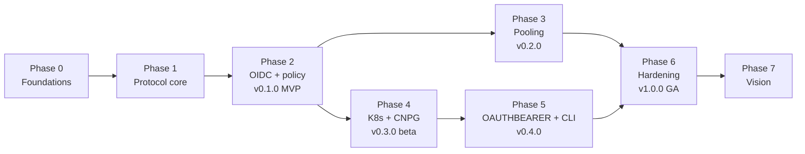

# pgproxy — Implementation Plan & Roadmap

> Status: **planning**. This plan turns [ARCHITECTURE.md](ARCHITECTURE.md) into
> phases with concrete deliverables and exit criteria. Durations are
> *indicative* for 1–2 full-time engineers. Treat them as relative size, not
> commitments. Bare section references (§) point to ARCHITECTURE.md; links
> to sections of this plan are written out.

## Contents

1. [Vision](#1-vision)
2. [Guiding principles](#2-guiding-principles)
3. [Scope of v1.0](#3-scope-of-v10)
4. [Success criteria](#4-success-criteria)
5. [Roadmap at a glance](#5-roadmap-at-a-glance)
6. [Phases in detail](#6-phases-in-detail)
7. [Cross-cutting workstreams](#7-cross-cutting-workstreams)
8. [Compatibility matrix](#8-compatibility-matrix)
9. [Risks and mitigations](#9-risks-and-mitigations)
10. [Open decisions](#10-open-decisions)
11. [ADR backlog](#11-adr-backlog)
12. [Definition of Done](#12-definition-of-done)

---

## 1. Vision

> *Access to PostgreSQL in Kubernetes should be granted, reviewed and revoked
> in the identity provider, not through passwords spread across wikis,
> vaults and CI variables.*

pgproxy is an identity-aware PostgreSQL gateway, written in Rust. It accepts
OIDC tokens from people (Entra ID, Keycloak, …) and from workloads
(Kubernetes ServiceAccounts, Azure Workload Identity, GitHub Actions). It maps
them through a central policy to least-privilege PostgreSQL roles and connects
to CloudNativePG clusters without shared superusers or long-lived passwords.
Every connection is audited with the real identity.

It improves on [gprxy](https://github.com/sathwick-p/gprxy) in correctness
(full protocol support, role enforcement on the data path), security (TLS
everywhere, default deny, no backend key leakage), operability
(Kubernetes-native, CNPG-aware, observable) and future-proofing (protocol 3.2,
PostgreSQL 18 OAUTHBEARER, direct TLS/SNI routing). See ARCHITECTURE §2.

## 2. Guiding principles

1. **Correctness before features.** The relay must be protocol-correct for
   every mainstream driver before any optimisation or extra feature.
2. **Secure by default.** TLS required for tokens, default deny, fail closed,
   no secrets in logs, no unsafe code in pgproxy's own crates.
3. **The database stays in charge of privileges.** pgproxy decides *which
   role* you get. PostgreSQL decides *what the role can do*.
4. **Kubernetes-native, not Kubernetes-only.** Every feature also works with a
   static config file outside Kubernetes. Kubernetes integrations are
   additions.
5. **Observable by design.** Every decision is explainable from metrics, logs
   and audit events.
6. **Small, well-bounded crates.** The protocol codec, auth, policy, pool and
   session crates are each testable in isolation.
7. **Measure, then optimise.** Benchmarks run in CI from Phase 1.

## 3. Scope of v1.0

**In scope**

- Full PostgreSQL protocol relay (3.0 and 3.2): simple and extended query,
  pipelining, COPY, LISTEN/NOTIFY, cancellation, SSLRequest and direct TLS.
- Client authentication: token as password and SASL OAUTHBEARER.
- Issuers: generic OIDC, Entra ID, Kubernetes (JWKS + TokenReview), GitHub
  Actions. Several issuers at the same time.
- Declarative policy (grants and deny rules) with per-grant limits and session
  lifetime.
- Backend login as the mapped role: certificate + `pg_ident` (strategy A),
  per-role certificates (B), per-role passwords (C).
- Pooling: session mode and transaction mode with prepared-statement
  virtualisation.
- CloudNativePG: service discovery, CA handling, failover-aware pools,
  examples.
- Kubernetes: Helm chart, probes, drain, HPA, PDB, NetworkPolicy,
  ServiceMonitor, alerts, dashboard. Cancel forwarding between replicas.
- Observability: Prometheus metrics, JSON logs, OTLP traces, audit stream.
- `pgproxyctl`: login (PKCE + device code), token, connect, doctor.
- Supply chain: signed multi-arch images, SBOM, provenance.

**Out of scope for v1.0** (candidates for Phase 7)

- Personal roles / JIT role provisioning, CRD-based policy, query-level
  policy, read/write splitting, Graph group-overage resolver, token
  introspection for opaque tokens, admin SQL console, external policy engines,
  sharding (never).

## 4. Success criteria

| Area | Criterion (measured in CI or release checklist) |
|---|---|
| Compatibility | 100 % pass rate in the client compatibility suite ([compatibility matrix](#8-compatibility-matrix)) for every release. |
| Correctness | No known protocol desyncs. The fuzzers run ≥ 1 h per release without new crashes. |
| Security | No high or critical findings open at release. Third-party review before 1.0. Threat model updated each minor release. |
| Performance | Session-mode overhead p99 < 100 µs per round trip. ≥ 90 % of direct `pgbench -S` TPS at 64 clients. ≤ 32 KiB memory per idle client. |
| Availability | Zero failed client reconnects after a CNPG switchover in the e2e test (beyond the one expected error per in-flight session). Rolling upgrade of pgproxy without failed new connections. |
| Operability | Install to first authenticated `psql` session in < 15 minutes following the CNPG + Entra ID guide. |

## 5. Roadmap at a glance

| Phase | Theme | Release | Indicative size |
|---|---|---|---|
| 0 | Foundations: repo, CI, ADRs, dev environment | — | 1–2 weeks |
| 1 | Protocol core: transparent TLS-terminating relay | `v0.1.0-alpha` | 4–6 weeks |
| 2 | OIDC authentication, policy, audit (MVP) | `v0.1.0` | 3–5 weeks |
| 3 | Pooling: reuse, limits, transaction mode | `v0.2.0` | 4–6 weeks |
| 4 | Kubernetes and CloudNativePG integration | `v0.3.0` (beta) | 3–5 weeks |
| 5 | Native OAuth (OAUTHBEARER) and client tooling | `v0.4.0` | 3–4 weeks |
| 6 | Hardening, performance, GA | `v1.0.0` | 4–6 weeks |
| 7 | Beyond 1.0 (vision) | `v1.x` | ongoing |

Phases 3 and 4 can run in parallel with two engineers.

---

## 6. Phases in detail

### Phase 0 — Foundations

**Goal:** a working skeleton that makes every later change safe and quick to
review.

- [ ] Cargo workspace with the crate layout from §5. Edition 2024, pinned
      `rust-toolchain.toml`, MSRV policy (stable − 2).
- [ ] `#![forbid(unsafe_code)]` and `#![deny(missing_docs)]` for public APIs.
      Clippy pedantic baseline.
- [ ] CI (GitHub Actions): `fmt`, `clippy -D warnings`, `test`, `cargo-deny`
      (licences, advisories, bans, sources), `cargo-audit`, `cargo-machete`,
      doc build. Caching. Required checks on `main`.
- [ ] Dev environment: `just`/`make` targets; `docker compose` with PostgreSQL
      14/16/18 + Keycloak + a mock OIDC issuer; `kind` config with the CNPG
      operator.
- [ ] Test harness crate: spin up PostgreSQL (testcontainers), a mock OIDC
      issuer (in-process, `rcgen`-generated keys, configurable claims) and
      client drivers.
- [ ] `docs/adr/` with template; ADR-001 … ADR-004 written ([ADR backlog](#11-adr-backlog)).
- [ ] `SECURITY.md` (disclosure process), `CONTRIBUTING.md`, `CODE_OF_CONDUCT.md`,
      licence file ([decision D1](#10-open-decisions)), issue and PR templates, Renovate or
      Dependabot.
- [ ] Threat model v0 (`docs/threat-model.md`, STRIDE per trust boundary).

**Exit criteria:** CI green on an empty workspace. `just dev-up` starts the
full local stack. ADR-001 to 004 accepted.

---

### Phase 1 — Protocol core

**Goal:** a protocol-correct, TLS-terminating, full-duplex relay to a static
backend. Client authentication is a development-only stub, behind the
`dev-insecure` cargo feature and excluded from release builds.

**`pgproxy-wire`**
- [ ] Startup-phase decoding: StartupMessage (3.0/3.2), SSLRequest,
      GSSENCRequest, CancelRequest, direct-TLS detection.
- [ ] Header-only framing for regular messages; streaming of large bodies.
- [ ] Typed views for the messages pgproxy must inspect: ReadyForQuery,
      ErrorResponse, ParameterStatus, BackendKeyData, Authentication*,
      Parse/Bind/Close, Copy*, Terminate.
- [ ] Encoders for messages pgproxy generates (errors, auth requests,
      ParameterStatus, BackendKeyData, NegotiateProtocolVersion).
- [ ] Pre-auth limits (startup ≤ 10 000 bytes, password ≤ 16 KiB, timeouts).
- [ ] cargo-fuzz targets for every decoder, plus property tests (round trip).

**`pgproxy-tls`**
- [ ] rustls server: SSLRequest upgrade, direct TLS with ALPN `postgresql`, SNI
      capture.
- [ ] rustls client to backend: `verify-full` / `verify-ca` / `require`, client
      certificates.
- [ ] Certificate hot reload (file watch), expiry metric.

**`pgproxy-session` (session mode, 1:1)**
- [ ] Connection state machine (§6.1).
- [ ] Full-duplex relay with protocol tracking (§7.3): transaction status,
      pending Sync, COPY state, FATAL detection, Terminate interception.
- [ ] Backend authentication client: SCRAM-SHA-256 (+PLUS), certificate,
      MD5 for legacy.
- [ ] Startup parameter synthesis from the real backend (§7.4); blocking of
      `role`, `session_authorization` and `pgproxy.*` in `options`.
- [ ] Proxy-generated cancel keys, local cancel registry, forwarding to the
      backend (single replica).
- [ ] Protocol version negotiation (3.0 ↔ 3.2 translation).
- [ ] Optional PROXY protocol v2 on listeners.

**`pgproxy` binary**
- [ ] Config loading (static YAML, schema validation).
- [ ] Admin HTTP: `/livez`, `/readyz`, `/metrics` (initial metrics).
- [ ] Graceful shutdown and drain (§4.3) with `TaskTracker` and
      `CancellationToken`.
- [ ] JSON logging with `Secret<T>` redaction.

**Testing**
- [ ] Client compatibility suite v1 ([compatibility matrix](#8-compatibility-matrix)): psql, libpq pipeline mode, pgjdbc,
      Npgsql, pgx, psycopg 3, asyncpg, node-postgres, tokio-postgres, sqlx,
      against PostgreSQL 14–18.
- [ ] Scenario tests: extended protocol with pipelining, errors mid-pipeline,
      COPY in/out (text and binary), LISTEN/NOTIFY while idle, cancel, 1 GB
      result stream, notices, `client_encoding` changes.
- [ ] Benchmark harness: pgbench direct vs through pgproxy; results published as
      a CI artifact with a regression gate (± 10 %).

**Exit criteria:** the compatibility suite passes against PostgreSQL 14–18.
No desync under fuzzed message sequences. Overhead is measured and documented.
→ **`v0.1.0-alpha`** (dev-only image, not for production).

---

### Phase 2 — OIDC authentication, policy and audit (MVP)

**Goal:** the first useful release. Developers and workloads log in with
tokens and get the right role on a CNPG cluster in a dev Kubernetes cluster.

**`pgproxy-auth`**
- [ ] Issuer registry from config. Issuer selection by exact `iss` match.
- [ ] OIDC discovery and JWKS cache: background refresh, single-flight and
      rate-limited unknown-`kid` refresh, stale-while-error, readiness gating
      (§8.3).
- [ ] JWT validation pipeline (§8.2): algorithm allow-list, `iss`/`aud`/`exp`/
      `nbf`/`iat` with leeway, optional `typ`, `azp`/`appid`, `tid`, scopes and
      roles.
- [ ] Claim mapping to `Identity` (subject, username, groups, roles, scopes,
      tenant, client ID, kind).
- [ ] Presets: `oidc`, `entra` (oid/tid/scp/roles/idtyp, overage *detection*),
      `kubernetes` (JWKS mode), `github-actions`.
- [ ] Token-as-password authentication on TLS listeners. Non-TLS is refused.

**`pgproxy-policy`**
- [ ] Policy model (§9.1): grants, deny rules, default deny,
      `user_semantics`.
- [ ] Decision type with matched grants and limits. Pure and fully
      unit-testable (table-driven plus property tests: "deny always wins",
      "no grant means deny").
- [ ] Per-identity connection limits.

**Backend identity**
- [ ] Strategies A (certificate + `pg_ident`), B (per-role certificate) and C
      (per-role password from files).
- [ ] Role safety check against `pg_roles` (no superuser, CREATEROLE,
      REPLICATION or BYPASSRLS unless explicitly allowed).
- [ ] Identity propagation GUCs (`pgproxy.sub`, `pgproxy.session_id`, …).

**Session lifetime (§12)**
- [ ] `on_token_expiry`, grace, `max_lifetime`, idle and
      idle-in-transaction timeouts.

**Audit (`pgproxy-audit`)**
- [ ] Event schema v1 (§16.3) for connection, session and cancel events.
      Stdout sink.
- [ ] A precise denial reason in audit, a generic one to the client.

**Deployment (basic)**
- [ ] Multi-arch container image (distroless, non-root). Helm chart v0 with
      ConfigMap and Secret mounts, Service, probes and security context.
- [ ] Example: kind + CNPG + Keycloak, end to end with `psql`.

**Testing**
- [ ] Mock-issuer tests for every validation rule (expired, wrong `aud`, wrong
      `iss`, `alg=none`, HS256 with public key as secret, unknown `kid`
      flood, rotated keys, oversized token).
- [ ] Real-IdP tests: Keycloak (CI), Kubernetes SA tokens on kind (CI), Entra
      ID (nightly, test tenant, credentials through GitHub OIDC federation, no
      stored secrets).

**Exit criteria:** a developer can follow the kind example and connect with
an IdP token as the mapped role. Denials are explained in the audit log. All
validation negative tests pass. → **`v0.1.0` (MVP)**.

---

### Phase 3 — Pooling

**Goal:** real connection reuse with predictable limits, then transaction
pooling for high-concurrency apps.

- [ ] Pool manager keyed by `(backend, database, role)` (§10.3).
- [ ] Limits: per pool, per backend, per identity, global clients. FIFO wait
      queue with `acquire_timeout` and `53300` on exhaustion.
- [ ] Health checks, `max_lifetime` with jitter, `idle_timeout`, exponential
      backoff on connect failure.
- [ ] Reset on release (`reset_query`). Discard on failed reset or FATAL.
- [ ] Session-parameter tracking and apply-on-checkout (§10.4).
- [ ] **Transaction mode** (§10.5): detach and attach at transaction
      boundaries, pipeline-aware release, COPY-aware release.
- [ ] Prepared-statement virtualisation: renaming, per-connection registry,
      `Parse` injection, LRU (`max_prepared_statements`).
- [ ] `sql-inspect` feature (`pg_query`) for session-state detection in
      transaction mode (`warn | pin | error`).
- [ ] Cancel safety in transaction mode (cancel-in-flight release delay, §11).
- [ ] Pool metrics and saturation alerts.
- [ ] Tests: the compatibility suite in transaction mode (with documented
      exclusions such as LISTEN and session GUCs), a soak test (24 h, mixed
      workload, no leak), a pool-exhaustion test, and a thundering-herd test.

**Exit criteria:** pgbench with 1 000 clients against 50 backend connections in
transaction mode, with no errors and stable memory. The compatibility suite
passes in both modes. → **`v0.2.0`**.

---

### Phase 4 — Kubernetes and CloudNativePG

**Goal:** production-grade operation in Kubernetes with first-class CNPG
support.

- [ ] `pgproxy-k8s`: watch CNPG `Cluster` resources (`currentPrimary`, phase)
      and invalidate pools on switchover (§10.6).
- [ ] `cnpg` backend kind: service resolution (`rw`/`ro`/`r`), CA from
      `<cluster>-ca`.
- [ ] Kubernetes issuer in **TokenReview** mode with caching.
- [ ] Multi-replica cancel forwarding: replica tags, peer port, headless-Service
      discovery, broadcast fallback (§11).
- [ ] Hot reload of config, certificates and Secrets (file watch + SIGHUP +
      admin endpoint).
- [ ] Routing by SNI for many clusters behind one load balancer.
- [ ] Helm chart v1: HPA (CPU and connection metric), PDB, topology spread,
      NetworkPolicy (clients → 5432, peers → 6543, egress to IdP, CNPG and API
      server), ServiceMonitor, PrometheusRule, Grafana dashboard, computed
      `terminationGracePeriodSeconds`, values schema.
- [ ] Connection-budget validation: replicas × pool limits vs CNPG
      `max_connections` (chart-time warning and runtime metric).
- [ ] Examples and guides:
  - [ ] CNPG + cert-manager client CA + strategy A (recommended setup).
  - [ ] CNPG 1.30 `DatabaseRole` with `clientCertificate` (strategy B).
  - [ ] CNPG `podSelectorRefs` to pin certificate logins to pgproxy pod IPs.
  - [ ] **Entra ID guide**: app registrations, app roles, v2 tokens, Azure CLI
        pre-authorization, AKS Workload Identity.
- [ ] e2e on kind (CI): CNPG switchover (`kubectl cnpg promote`), pgproxy
      rolling update, pod kill, node drain, certificate rotation, config
      reload, all under load.

**Exit criteria:** the e2e chaos suite passes. An install from the guide
reaches a first session in < 15 minutes. → **`v0.3.0` (beta)**.

---

### Phase 5 — Native OAuth and client tooling

**Goal:** a smooth experience for people, including password-free psql 18.

- [ ] SASL **OAUTHBEARER** server (RFC 7628) on dedicated listeners or routes:
      discovery response (`openid-configuration`, `scope`), token validation
      through the same pipeline.
- [ ] Interop tests with libpq/psql 18 built-in device flow against Keycloak
      and Entra ID.
- [ ] `pgproxyctl`:
  - [ ] `login`: authorization code + PKCE (loopback) and device code; token
        cache in the OS keychain; refresh tokens.
  - [ ] `token`: prints a fresh access token
        (`PGPASSWORD=$(pgproxyctl token) psql …`).
  - [ ] `connect` / `psql`: wrapper that execs psql with token and TLS settings.
  - [ ] `doctor`: checks TLS, issuer reachability, token claims against
        policy (dry run), and CNPG role safety (§9.2).
  - [ ] `explain`: shows which grants match a given token (local policy
        evaluation).
  - [ ] Distribution: Homebrew, Scoop, winget, `.deb`/`.rpm`, `cargo install`;
        kubectl plugin via Krew (`kubectl pgproxy connect`).
- [ ] libpq "service file" (`pg_service.conf`) generator for teams.

**Exit criteria:** psql 18 connects through device flow against Entra ID
without any extra tool. `pgproxyctl` works on Linux, macOS and Windows.
→ **`v0.4.0`**.

---

### Phase 6 — Hardening, performance and GA

**Goal:** something you can bet production on.

- [ ] External security review / penetration test. Fix all high and critical
      findings.
- [ ] Threat model v1. `SECURITY.md` with response SLAs.
- [ ] Continuous fuzzing (OSS-Fuzz application or a scheduled CI fuzz job).
- [ ] Performance work driven by profiles (`perf`, `tokio-console`,
      flamegraphs). Meet the [success-criteria](#4-success-criteria) targets. Document sizing guidance.
- [ ] FIPS build variant (`aws-lc-rs` FIPS).
- [ ] Release engineering: reproducible builds, SBOM (CycloneDX), cosign
      keyless signing, SLSA provenance, multi-arch (amd64/arm64), Helm chart in
      an OCI registry, signed chart.
- [ ] Configuration API `v1` (stable). Deprecation policy. Upgrade guide.
- [ ] Documentation site: concepts, guides (CNPG, Entra ID, Keycloak, Okta,
      GitHub Actions), reference (config, metrics, audit schema), runbooks
      (pool exhaustion, IdP outage, certificate expiry, switchover).
- [ ] Compatibility and support policy (supported PostgreSQL, Kubernetes, CNPG
      and IdP versions).

**Exit criteria:** all [success criteria](#4-success-criteria) met. No open high or critical
issues. → **`v1.0.0`**.

---

### Phase 7 — Beyond 1.0 (vision backlog, ordered by expected value)

1. **Personal roles / JIT provisioning.** One PostgreSQL role per identity,
   created on first login (or ahead of time via SCIM-like sync), with group →
   role memberships reconciled and inactive roles removed. `current_user` is
   the human, which gives exact pgaudit attribution and RLS on the real
   identity. Optional output as CNPG `DatabaseRole` resources for GitOps.
2. **CRDs and controller.** `PgProxyRoute` and `PgProxyAccessPolicy` so
   application teams can own their access policy next to their CNPG cluster,
   with RBAC-delegated and validating admission.
3. **Just-in-time elevated access.** Time-bound grants (for example "owner role
   for 1 h") requested via CLI or chat, approved by a second person, fully
   audited, auto-expiring. Break-glass with mandatory reason.
4. **Query-level policy** (`sql-inspect`): read-only enforcement, DDL blocking,
   statement allow-lists per grant, row-limit guards for humans on production.
5. **Read/write splitting** to CNPG `-ro` with lag awareness.
6. **Entra ID groups-overage resolver** through Microsoft Graph using
   Workload Identity, with caching.
7. **Opaque tokens** via RFC 7662 introspection. **DPoP / mTLS-bound tokens**
   (RFC 9449 / RFC 8705) for proof-of-possession.
8. **Admin console** over the PostgreSQL protocol (`SHOW POOLS`,
   `SHOW SESSIONS`, `KILL`), PgBouncer-style.
9. **Pluggable policy engines** (CEL expressions, OPA, Cedar) behind the
   `PolicyEngine` trait.
10. **Shared connection budget** across replicas (coordination via Kubernetes
    Leases or gossip) for automatic pool sizing under HPA.
11. **Multi-cluster / multi-region** routing and failover-aware DNS.

---

## 7. Cross-cutting workstreams

| Workstream | Practices |
|---|---|
| **Testing** | Unit tests per crate. Golden protocol transcripts. The compatibility suite ([compatibility matrix](#8-compatibility-matrix)) is the release gate. testcontainers integration tests. kind e2e with CNPG. Fuzzing. Soak and chaos tests. Benchmarks with regression gates. |
| **Security** | Threat model kept current. `cargo-deny`/`cargo-audit` on every PR. Dependency review for new crates (maintenance, `unsafe`, licence). Secrets never in env or logs. Security review per phase on auth, policy and session code. |
| **Documentation** | Docs live next to code. Every config field documented in the schema. A guide per integration. ADR for every significant decision. CHANGELOG (Keep a Changelog). Conventional commits. |
| **Release engineering** | SemVer. Release Please or similar. Signed artifacts. `main` always releasable. Feature flags for experimental features (`experimental.*` config). |
| **Performance** | Benchmarks in CI from Phase 1. Profiling before optimisation. Memory budget per connection tracked as a metric in tests. |

## 8. Compatibility matrix

**Client drivers** (each run against every backend version):

| Driver | Versions | Notable features exercised |
|---|---|---|
| libpq / psql | 14, 16, 17, 18 | Pipeline mode, `sslnegotiation=direct` (17+), protocol 3.2 and OAUTHBEARER (18) |
| pgjdbc | 42.7.x | Extended protocol, server-prepared statements, COPY API |
| Npgsql | 8.x, 9.x | Multiplexing, binary COPY |
| pgx (Go) | v5 | Pipelining, `QueryExecModeCacheStatement` |
| psycopg | 3.x | Pipeline mode, server-side cursors |
| asyncpg | latest | Heavy prepared-statement use |
| node-postgres | latest | Simple and extended protocol |
| tokio-postgres / sqlx | latest | Pipelining, binary formats |

**Backends:** PostgreSQL 14, 15, 16, 17, 18 (CNPG images), plus 19 beta as a
non-blocking forward-looking job. Strategy A `+role` mapping requires 16+.
**Kubernetes:** the versions supported by the current CNPG releases (today
1.34–1.36). **CloudNativePG:** the currently supported releases (today 1.29
and 1.30). The `DatabaseRole` features require 1.30+.
**IdPs:** Keycloak and Kubernetes (CI). Entra ID (nightly). Okta, Auth0,
Google, Dex and GitHub Actions (preset tests with recorded discovery documents
and keys, plus periodic live checks).

## 9. Risks and mitigations

| Risk | Impact | Likelihood | Mitigation |
|---|---|---|---|
| Protocol edge cases (pipelining, COPY, error recovery) cause desyncs | High | Medium | Header-only relay with minimal state; golden transcripts; fuzzing; broad driver matrix from Phase 1. |
| Transaction-mode semantics surprise users | Medium | High | Session mode by default; explicit opt-in per grant; `sql-inspect` detection; clear docs, like PgBouncer's. |
| Token lifetime vs long sessions (disconnects every ~1 h) | Medium | High | `terminate_when_idle` with grace; configurable per grant; app pools reconnect transparently; `pgproxyctl` refreshes. |
| Entra ID specifics (v1/v2 tokens, overage, guest users) | Medium | Medium | Dedicated `entra` preset; nightly real-tenant tests; guide with a manifest checklist; fail closed on overage. |
| `pg_ident +role` needs PostgreSQL 16+ | Low | Medium | Explicit role lists for 14–15; strategies B and C as alternatives. |
| Connection budget exceeded under HPA | High | Medium | Chart-time validation; runtime metric and alert; Phase 7 shared budget. |
| A compromised proxy can log in as any `pgproxy_login` member | High | Low | Role safety checks; certificate-login pinning to proxy pod IPs; NetworkPolicy; least-privilege role design; short-lived certificates; audit. |
| Dependency or supply-chain vulnerability | High | Low | cargo-deny/audit, minimal dependencies, pinned versions, signed releases, SBOM. |
| Unmaintained crates (for example YAML) | Low | Medium | Wrap behind internal modules; ADR on choices; Renovate. |
| Scope creep (sharding, query rewriting) | Medium | Medium | Explicit non-goals; Phase 7 backlog gated by ADRs. |
| CNPG API changes | Medium | Low | Watch only stable fields; version-tolerant deserialisation; e2e against supported CNPG releases. |

## 10. Open decisions

These need the project owner's input. Proposed defaults are in **bold**.

| # | Decision | Options | Proposal |
|---|---|---|---|
| D1 | Licence | **Apache-2.0**, MIT/Apache dual, MPL-2.0 (gprxy's), AGPL | **Apache-2.0**: patent grant, CNCF-friendly, compatible with the ecosystem. pgproxy is a clean-room implementation, so gprxy's MPL-2.0 does not apply. |
| D2 | Project and binary name | `pgproxy` (generic; other projects use the name), something distinctive | Keep `pgproxy` for the repo. Check registry and crates.io conflicts before v0.1.0. |
| D3 | Default `user_semantics` | `role`, `identity`, **`auto`** | **`auto`**: an entitled role name selects that role; the identity's own name or `*` selects the default role. |
| D4 | Default pool mode | **`session`**, `transaction` | **`session`** (compatibility first). |
| D5 | Default `on_token_expiry` | `terminate`, **`terminate_when_idle`**, `ignore` | **`terminate_when_idle`** with 5 minutes grace and 12 h max lifetime. |
| D6 | Config format | **YAML** (with JSON Schema), TOML | **YAML**: Kubernetes-native; the schema gives editor validation. |
| D7 | How pgproxy reads CNPG Secrets | **Volume mounts**, API watch | **Mounts** for v1 (less RBAC); API watch as an option in Phase 4. |
| D8 | Minimum supported PostgreSQL | **14**, 16 | **14** (oldest supported by CNPG); strategy A documented as 16+. |
| D9 | Docs language | **English**, Norwegian | **English** for the code repository; translations later if needed. |

## 11. ADR backlog

| ADR | Title | Phase |
|---|---|---|
| 001 | Rust + Tokio as language and runtime | 0 |
| 002 | Own wire codec (header-only, streaming) instead of `pgwire`/`tokio-postgres` | 0 |
| 003 | Terminate client authentication at the proxy; never pass through | 0 |
| 004 | Backend login as the mapped role (cert + `pg_ident`), not `SET ROLE` | 0 |
| 005 | Proxy-generated cancel keys and peer forwarding | 1 |
| 006 | Configuration format, schema and hot-reload semantics | 1 |
| 007 | JWT library and JWKS cache semantics | 2 |
| 008 | Policy model v1 (grants, deny, user semantics) | 2 |
| 009 | Audit event schema v1 and compatibility guarantees | 2 |
| 010 | Transaction pooling and prepared-statement virtualisation | 3 |
| 011 | CNPG integration: watch vs poll, Secret access | 4 |
| 012 | OAUTHBEARER listener selection | 5 |
| 013 | io_uring: deferred until benchmarks justify it | 6 |

## 12. Definition of Done

A change is done when:

- [ ] Code is reviewed, `fmt`/`clippy`/`deny` are clean, and there is no new
      `unsafe`.
- [ ] Unit tests cover the logic. The compatibility suite passes when protocol
      or session code changed.
- [ ] New config fields are in the schema with docs and defaults.
- [ ] New behaviour is observable (metric, log or audit event, as relevant).
- [ ] Security impact was considered (threat model updated if a trust boundary
      changed).
- [ ] Docs and CHANGELOG are updated. There is an ADR if the change is
      architectural.
- [ ] Benchmarks show no regression > 10 % on the hot path.
