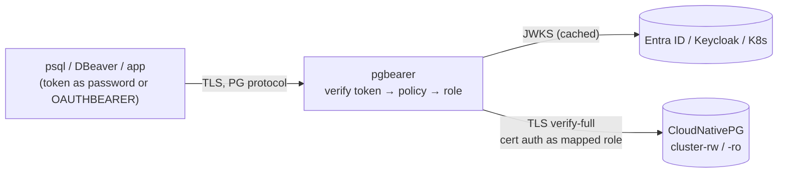

# pgbearer

**An identity-aware PostgreSQL gateway for Kubernetes, written in Rust.**
Log in to PostgreSQL with your OIDC identity (Microsoft Entra ID, Keycloak,
Okta, Kubernetes ServiceAccounts, GitHub Actions …). There are no database
passwords to hand out or rotate, and access is governed centrally. It is built
to run in front of [CloudNativePG](https://cloudnative-pg.io) clusters.

*Present a **bearer** token, get a least-privilege **PostgreSQL** role.*

> [!IMPORTANT]
> **Status: planning / pre-alpha.** There is no usable code yet. This
> repository holds the architecture and roadmap. Read
> [ARCHITECTURE.md](ARCHITECTURE.md) and [PLAN.md](PLAN.md), and feedback is
> welcome in issues. The project was planned under the working name
> *pgproxy*. The repository now lives at
> [egkristi/pgbearer](https://github.com/egkristi/pgbearer).

---

## Why

Most teams still reach production databases with shared passwords kept in
wikis, vaults and CI variables. Offboarding is manual, audit logs show
`app_user`, and no one can say who ran which query.

pgbearer moves database access into your identity provider:

- **No database passwords for people.** Users connect with a short-lived
  OIDC access token, sent as the password or natively with psql 18's OAuth
  device flow.
- **Workload identity for apps and CI.** Pods use their Kubernetes
  ServiceAccount token. Pipelines use GitHub Actions OIDC. Azure workloads use
  Workload Identity.
- **Central, default-deny policy.** IdP app roles, groups and claims map to
  *least-privilege PostgreSQL roles*, per cluster and per database.
- **The database stays in charge.** pgbearer logs in **as the mapped role**
  (certificate authentication, no shared superuser). GRANTs, RLS and pgaudit
  work as usual.
- **Audit with real identities.** Every connection and decision is logged with
  issuer, subject, client and role, and can be joined with PostgreSQL logs.
- **Kubernetes-native and CNPG-aware.** Helm chart, graceful drain, hot
  reload, failover-aware pools, and cancellation that works across replicas.

## How it works



1. The client connects over TLS and presents an access token.
2. pgbearer validates it (signature, issuer, audience, expiry, tenant, scopes)
   against the IdP's cached JWKS.
3. The policy decides which **PostgreSQL role** the identity may use on which
   cluster and database.
4. pgbearer uses a pooled backend connection, or opens one, *as that role*
   (certificate auth with `pg_ident`; no passwords), then relays the session
   with full protocol support. That includes the extended protocol,
   pipelining, COPY, LISTEN/NOTIFY and cancellation.

## What it will look like

**People with Entra ID: token as password, works with any client:**

```bash
export PGPASSWORD=$(az account get-access-token \
    --scope api://pgbearer/Database.Connect --query accessToken -o tsv)
psql "host=orders.db.example.com dbname=orders user=orders_readonly sslmode=verify-full"
```

**People with psql 18: native OAuth device flow, no extra tools:**

```bash
psql "host=oauth.orders.db.example.com dbname=orders user=orders_readonly \
      oauth_issuer=https://login.microsoftonline.com/<tenant-id>/v2.0 \
      oauth_client_id=<client-id>"
```

**With the companion CLI:**

```bash
pgbearerctl login                       # browser (PKCE) or device code
pgbearerctl psql orders                 # fresh token + TLS settings, then exec psql
```

**Policy (excerpt):**

```yaml
policies:
  - name: orders-analysts
    when: { issuer: entra, roles_any: ["Orders.Analyst"] }
    grant: { backend: orders, databases: [orders], pg_roles: [orders_readonly] }

  - name: orders-api                    # in-cluster workload, no secrets at all
    when: { issuer: k8s, subject: "system:serviceaccount:orders:orders-api" }
    grant: { backend: orders, databases: [orders], pg_roles: [orders_app], pool_mode: transaction }
```

## Planned features

| Area | Highlights |
|---|---|
| Protocol | PostgreSQL protocol 3.0 and 3.2 (PostgreSQL 18), direct TLS with ALPN/SNI (PostgreSQL 17+), extended protocol and pipelining, COPY, LISTEN/NOTIFY, cancellation across replicas |
| Authentication | Token as password; SASL OAUTHBEARER; issuers: OIDC, Entra ID, Kubernetes (JWKS or TokenReview), GitHub Actions; several at once |
| Authorization | Default deny; grants and deny rules on roles, groups, scopes, tenant and subject; per-identity limits; session lifetime tied to token expiry |
| Backend identity | Certificate + `pg_ident` (recommended), per-role certificates (CNPG `DatabaseRole`), per-role SCRAM passwords; role safety checks |
| Pooling | Session mode (default) and transaction mode with prepared-statement support; bounded queues; failover-aware |
| Kubernetes | Helm chart, HPA/PDB/NetworkPolicy, hot reload, SNI routing for many clusters, CNPG `Cluster` watch |
| Observability | Prometheus metrics, OTLP traces, JSON logs, a dedicated audit event stream |
| Supply chain | Rust with no `unsafe` in pgbearer's own code, fuzzed parsers, signed multi-arch images, SBOM, SLSA provenance |

## Roadmap

| Release | Milestone |
|---|---|
| `v0.1.0-alpha` | Protocol core: TLS-terminating, full-duplex relay |
| `v0.1.0` | **MVP**: OIDC authentication, policy, backend login as mapped role, audit |
| `v0.2.0` | Pooling: limits, session and transaction mode |
| `v0.3.0` | Beta: Kubernetes and CloudNativePG integration, Entra ID guide |
| `v0.4.0` | OAUTHBEARER (psql 18) and `pgbearerctl` |
| `v1.0.0` | Hardened GA: security review, performance targets, stable config API |

Details, exit criteria and risks are in [PLAN.md](PLAN.md).

## Relationship to gprxy

pgbearer is inspired by [gprxy](https://github.com/sathwick-p/gprxy) (Go),
which demonstrated SSO tokens as PostgreSQL passwords. pgbearer is a clean-room
reimplementation in Rust. It addresses structural issues found in a review of
gprxy, summarised in [ARCHITECTURE.md §2](ARCHITECTURE.md#2-lessons-from-gprxy).
Among them:

- Role mapping is enforced on the actual query connection, not only during
  authentication.
- A full-duplex relay, so the extended protocol, pipelining and COPY work with
  every driver.
- Real pooling with limits and timeouts.
- Cancellation that works behind a load balancer.
- TLS to the backend.
- Token-expiry handling.
- Multi-issuer OIDC beyond Auth0.

## Documentation

- [ARCHITECTURE.md](ARCHITECTURE.md): target architecture, protocol handling,
  authentication, policy, pooling, CNPG and Entra ID integration, security,
  failure modes.
- [PLAN.md](PLAN.md): phased roadmap, success criteria, compatibility matrix,
  risks, open decisions.

## Contributing

The project is in the design phase. The most useful contributions right now:

- Review of the architecture: open an issue with the section reference
  (for example "§9.2 backend identity").
- Real-world requirements: IdPs, drivers and deployment topologies you need
  supported.
- Experience from running PgBouncer, PgDog or CNPG poolers at scale.

## License

Licensed under the [Apache License, Version 2.0](LICENSE).
